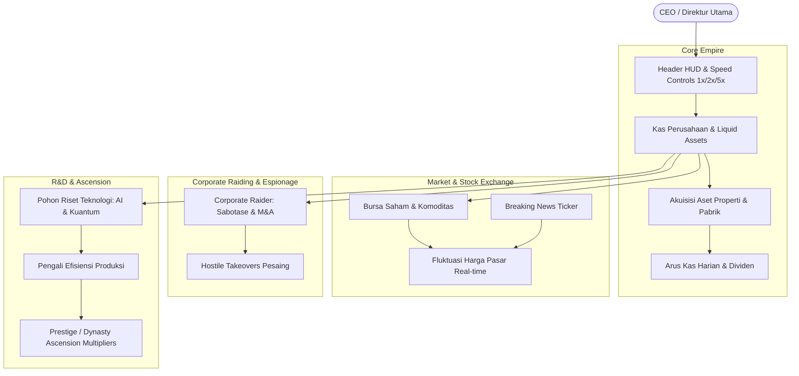

# 🏢 SimuCorp OS — Cyber Economy & Empire Simulator

<p align="center">
  
  
  
  
  
  
  
</p>

<p align="center">
  🌐 <strong>Live Playable Website:</strong><br>
  👉 <a href="https://olyxmintabansos-byte.github.io/simucorp-os/" target="_blank"><strong>https://olyxmintabansos-byte.github.io/simucorp-os/</strong></a>
</p>

---

> **Heavyweight Cyberpunk Business & Financial Empire Simulation OS — Bangun konglomerasi megakorporasi masa depan, kendalikan pasar bursa saham, lakukan akuisisi musuh (hostile takeovers), kembangkan pohon riset teknologi kuantum, dan kuasai ekonomi global.**

**SimuCorp OS** adalah aplikasi simulasi bisnis dan strategi makroekonomi mendalam yang dirancang dengan estetika *Cyberpunk Dark Neon*. Dibangun dengan arsitektur **Next.js 16 App Router**, **React 19**, **Tailwind CSS v4**, dan **Recharts**, game ini menghadirkan mekanik simulasi pasar modal, espionase korporat, serta manajemen likuiditas tanpa jeda waktu dan 100% berjalan di sisi klien (*local-first*).

---

## 📑 Daftar Isi

- [Live Demo](#-live-demo)
- [Diagram Alur Ekonomi Sistem](#-diagram-alur-ekonomi-sistem)
- [Fitur Utama](#-fitur-utama)
- [Modul & Halaman Simulasi](#-modul--halaman-simulasi)
- [Teknologi yang Digunakan](#-teknologi-yang-digunakan)
- [Struktur Folder](#-struktur-folder)
- [Panduan Menjalankan Secara Lokal](#-panduan-menjalankan-secara-lokal)
- [Lisensi & Atribusi Hak Cipta](#-lisensi--atribusi-hak-cipta)

---

## 🌟 Live Demo

Nikmati simulasi megakorporasi langsung di browser Anda tanpa instalasi server:  
👉 **[https://olyxmintabansos-byte.github.io/simucorp-os/](https://olyxmintabansos-byte.github.io/simucorp-os/)**

---

## 🔄 Diagram Alur Ekonomi Sistem



---

## ✨ Fitur Utama

- 📊 **Real-time Financial Dashboard:** Metrik live pemantauan Total Net Worth, Cadangan Kas (*Cash Reserves*), Hutang Obligasi (*Corporate Debt*), dan Kapitalisasi Pasar (*Market Cap*) dengan visualisasi grafik tren Recharts interaktif.
- 📈 **Bursa Saham & Komoditas Dinamis (`/market`):** Simulasikan perdagangan saham perusahaan AI, Energi Nuklir, Bio-Farma, dan Logam Langka dengan volatilitas realistis yang dipicu oleh algoritma tren acak.
- 🗞️ **Live Breaking News Ticker:** Siaran berita pasar modal berjalan (*crawler marquee*) yang secara dinamis merefleksikan sentimen pasar dan peristiwa makroekonomi global.
- ⚔️ **Corporate Raiding & Espionase (`/raider`):** Lakukan aksi korporat agresif seperti *hostile takeovers*, spionase industri, kampanye pemerasan saham, dan pembelian lisensi paten pesaing.
- 🔬 **Pohon Riset Teknologi & R&D (`/research`):** Kembangkan inovasi sains bertingkat (Komputasi Kuantum, Otomasi AI Agen, Penambangan Asteroid Antariksa) untuk meningkatkan margin laba bersih.
- 👑 **Prestige & Dynasty Ascension (`/prestige`):** Sistem reset konglomerat (*spin-off IPO*) untuk membuka perk dinasti permanen dan multiplier keuntungan berlipat ganda.
- ⏱️ **Time Dilation HUD:** Kontrol kecepatan simulasi dengan kecepatan fleksibel (**1x, 2x, 5x, dan Pause**) disertai efek audio synthesizer murni.

---

## 🧭 Modul & Halaman Simulasi

| Rute | Modul | Deskripsi |
|---|---|---|
| `/` | **Empire Headquarters** | Ringkasan eksekutif, KPI neraca keuangan, daftar anak usaha, dan portofolio aset. |
| `/market` | **Stock & Crypto Exchange** | Terminal perdagangan saham, valuta kripto korporat, dan order beli/jual instan. |
| `/raider` | **Corporate Raiding & M&A** | Ruang operasi perang korporat, spionase, dan akuisisi paksa perusahaan kompetitor. |
| `/research` | **R&D Tech Tree** | Laboratorium riset teknologi masa depan dengan prasyarat dan pohon peningkatan efisiensi. |
| `/prestige` | **Ascension & Legacy** | Rekap dinasti korporasi untuk melakukan spin-off konglomerat dan klaim dividen warisan. |

---

## 🛠️ Teknologi yang Digunakan

- **Framework:** [Next.js 16](https://nextjs.org/) (App Router Architecture)
- **Library UI:** [React 19](https://react.dev/)
- **Bahasa:** [TypeScript](https://www.typescriptlang.org/) (Strict Type Safety)
- **Styling:** [Tailwind CSS v4](https://tailwindcss.com/) dengan palet Cyberpunk Slate & Neon Accent
- **Visualisasi Data:** [Recharts](https://recharts.org/)
- **Ikonografi:** [Lucide React](https://lucide.dev/)
- **State Engine:** React Context API (`GameContext.tsx`) + `localStorage` persistence

---

## 📁 Struktur Folder

```text
simucorp-os/
├── src/
│   ├── app/
│   │   ├── market/          # Halaman Bursa Saham & Komoditas
│   │   ├── prestige/        # Halaman Dynasty & Ascension
│   │   ├── raider/          # Halaman Corporate Raiding & Spionase
│   │   ├── research/        # Halaman R&D Tech Tree
│   │   ├── globals.css      # Styling Cyberpunk Dark Neon & glow utilities
│   │   ├── layout.tsx       # Master Shell dengan Header HUD & Nav
│   │   └── page.tsx         # Dashboard Markas Besar Korporasi (HQ)
│   ├── components/
│   │   ├── empire/          # Widget metrik anak usaha & aset fisik
│   │   ├── HeaderHUD.tsx    # Bar status waktu, kas, & kontrol kecepatan
│   │   ├── Navbar.tsx       # Navigasi tab antar departemen
│   │   └── NewsTicker.tsx   # Ticker berita pasar modal berjalan
│   ├── context/
│   │   └── GameContext.tsx  # Game loop engine, kalkulasi bunga, & state pasar
│   ├── lib/
│   │   └── utils.ts         # Formatter mata uang (B / M / T USD)
│   └── types/
│       └── simucorp.ts      # TypeScript interfaces seluruh entitas game
├── public/                  # Favicon & aset SVG
├── next.config.ts           # Konfigurasi static export GitHub Pages
├── package.json
└── tsconfig.json
```

---

## 🚀 Panduan Menjalankan Secara Lokal

### 1. Prasyarat
Pastikan komputer memiliki **Node.js versi 18+** atau **20+**:
```bash
node -v
```

### 2. Instalasi Dependensi
```bash
git clone https://github.com/olyxmintabansos-byte/simucorp-os.git
cd simucorp-os
npm install
```

### 3. Menjalankan Server Pengembangan
```bash
npm run dev
```
Buka peramban pada alamat:  
👉 **`http://localhost:3000`**

### 4. Build untuk Produksi & GitHub Pages
```bash
npm run build
```

---

## 📄 Lisensi & Atribusi Hak Cipta

<p align="center">
  
  
</p>

<p align="center">
  Crafted with passion & precision by <strong><a href="https://github.com/olyxmintabansos-byte">Olyx</a></strong><br>
  <strong>© 2026 by Olyx (@olyxmintabansos-byte)</strong>. All rights reserved.<br>
  Distributed under the <a href="https://opensource.org/licenses/MIT">MIT License</a>.
</p>
