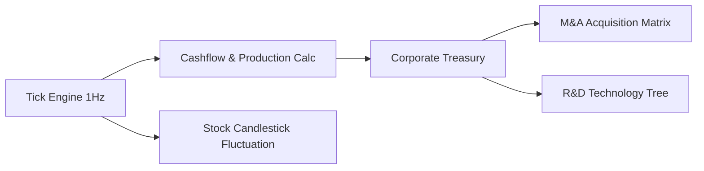

# 📈 SimuCorp OS — Cyber Megacorp Tycoon & Stock Market

> **Live Demo:** [https://olyxmintabansos-byte.github.io/simucorp-os/](https://olyxmintabansos-byte.github.io/simucorp-os/)

SimuCorp OS adalah simulator konglomerasi ekonomi siber berkecepatan tinggi dengan 12 sektor industri, bursa saham Wall Street virtual real-time candlestick charts, pohon riset teknologi (R&D Tree), hostile corporate takeovers (M&A), dan reinkarnasi Cyber Shards.

## 🚀 Fitur Utama
- **12 Unit Bisnis Multi-Tier:** Ekspansi dari Cyber Cafe s/d Pembangkit Reaktor Fusi Orbital.
- **Wall Street Virtual Real-Time:** Fluktuasi harga saham live per detik dengan grafik candlestick dinamis dan auto-trading bot.
- **R&D Tech Tree 7 Cabang:** Upgrade teknologi riset untuk meningkatkan multiplier passive income korporasi.
- **Corporate Raider (M&A):** Manuver hostile takeover mengakuisisi saham mayoritas (51%+) kompetitor untuk merebut pasar.
- **Prestige Reincarnation:** Reset konglomerasi untuk mengklaim Cyber Shards permanen ber-multiplier gila-gilaan.

## 🏗️ Diagram Arsitektur

